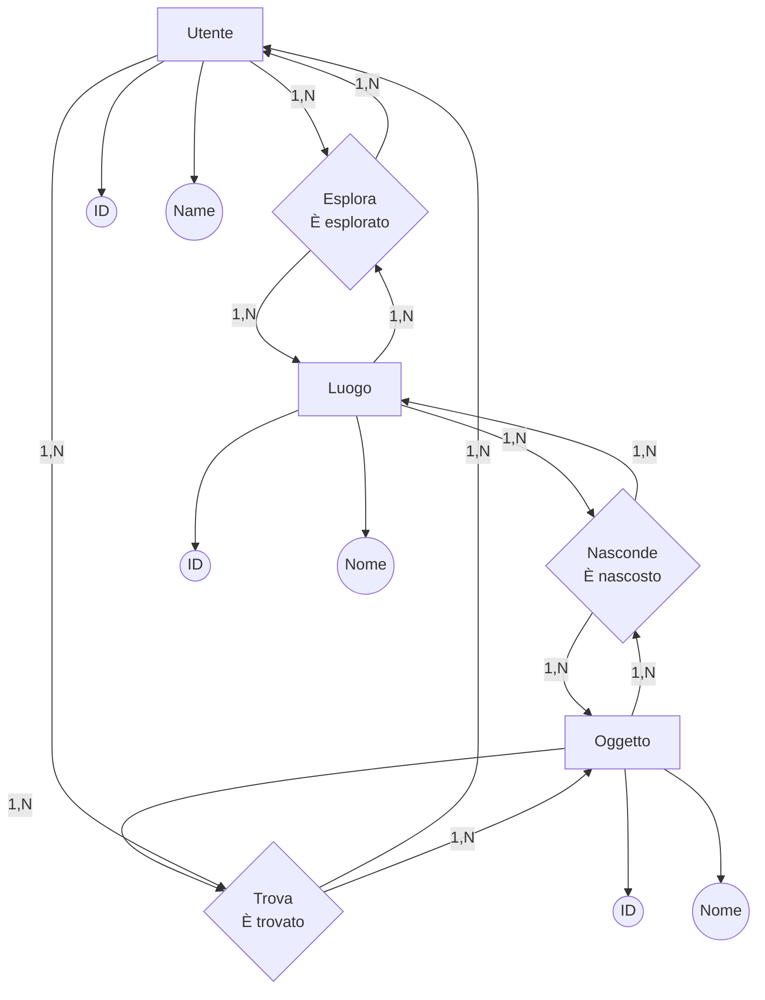
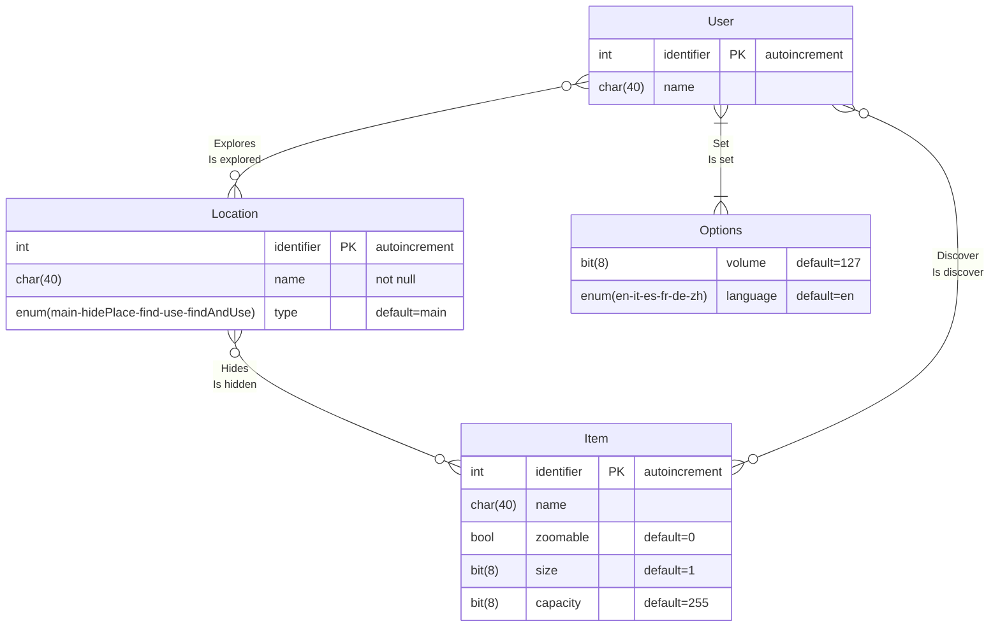
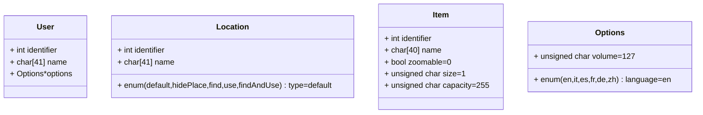

## ER design as learn at school

```mermaid
flowchart
  User[Utente]-->|1,N|Exploration{Esplora\nÈ esplorato}-->|1,N|Location[Luogo]
  Location[Luogo]-->|1,N|Exploration{Esplora\nÈ esplorato}-->|1,N|User[Utente]
  Location[Luogo]-->|1,N|Hide{Nasconde\nÈ nascosto}-->|1,N|Item[Oggetto]
  Item[Oggetto]-->|1,N|Hide{Nasconde\nÈ nascosto}-->|1,N|Location[Luogo]
  Item[Oggetto]-->|1,N|Discover{Trova\nÈ trovato}-->|1,N|User[Utente]
  User[Utente]-->|1,N|Discover{Trova\nÈ trovato}-->|1,N|Item[Oggetto]
  User[Utente]-->UserID((ID))
  User[Utente]-->UserName((Name))
  Location[Luogo]-->LocationID((ID))
  Location[Luogo]-->LocationName((Nome))
  Item[Oggetto]-->ItemID((ID))
  Item[Oggetto]-->ItemName((Nome))
```
## ER Model

```mermaid
erDiagram
  User{
    int identifier PK "autoincrement"
    char(40) name
  }
  Location{
    int identifier PK "autoincrement"
    char(40) name "not null"
    enum(main-hidePlace-find-use-findAndUse) type "default=main"
  }
  Item{
    int identifier PK "autoincrement"
    char(40) name
    bool zoomable "default=0"
    bit(8) size "default=1"
    bit(8) capacity "default=255"
  }
  Options{
    bit(8) volume "default=127"
    enum(en-it-es-fr-de-zh) language "default=en"
  }
  User }o--o{ Location : "Explores
  Is explored"
  Location }o--o{ Item : "Hides
  Is hidden"
  User }o--o{ Item : "Discover
  Is discover"
  User }|--|{ Options :"Set
  Is set"

```
## Object Oriented Model of the database

```mermaid
classDiagram
class User{
  + int identifier
  + char[41] name
  + Options*options
}
class Location{
  + int identifier
  + char[41] name
  + enum(default,hidePlace,find,use,findAndUse) type=default
}
class Item{
  + int identifier
  + char[40] name
  + bool zoomable=0
  + unsigned char size=1
  + unsigned char capacity=255
}
class Options{
  + unsigned char volume=127
  + enum(en,it,es,fr,de,zh) language=en
}
```