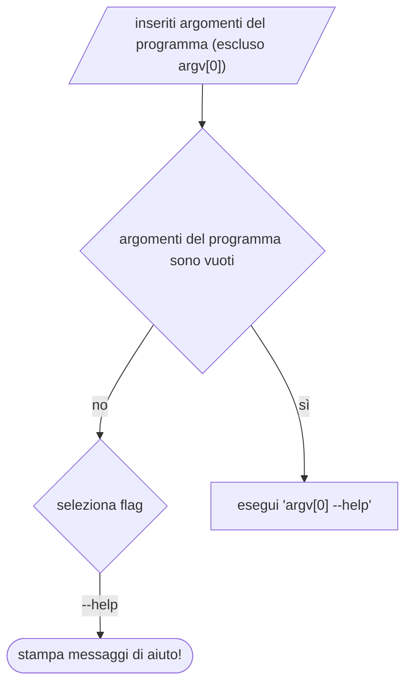

```mermaid
flowchart
gameArgumentsInput[/"inseriti argomenti del programma (escluso argv[0])"/]
gameArgumentsInputSelection{argomenti del programma sono vuoti}
flagSelection{seleziona flag}
helpExecution["esegui 'argv[0] --help'"]
helpCase([stampa messaggi di aiuto!])
gameArgumentsInput-->gameArgumentsInputSelection
gameArgumentsInputSelection-->|no|flagSelection
gameArgumentsInputSelection-->|sì|helpExecution
flagSelection-->|--help|helpCase
```