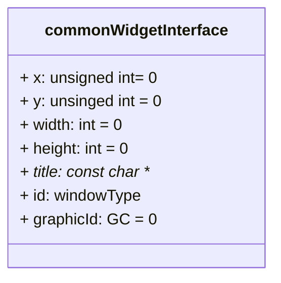

```mermaid
classDiagram

class commonWidgetInterface{
  + x: unsigned int= 0
  + y: unsinged int = 0
  + width: int = 0
  + height: int = 0
  + title: const char **
  + id: windowType
  + graphicId: GC = 0
}
```