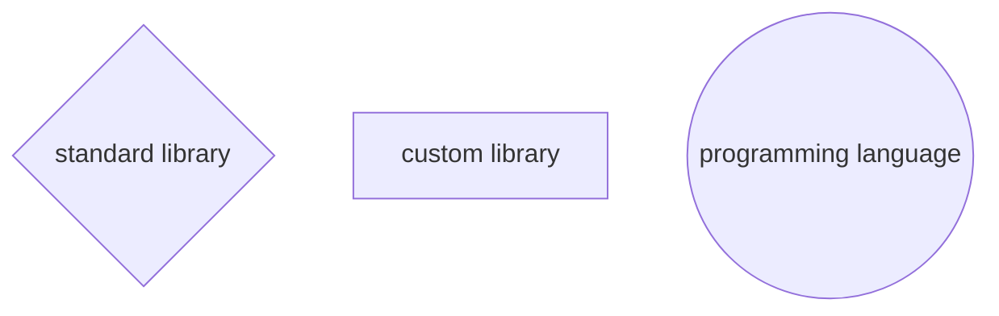

#### legend:

```mermaid
flowchart
  standardLibrary{standard library}
  customLibrary[custom library]
  programmingLanguage((programming language))
```

```mermaid
flowchart
  C((C))
  Cpp((C++))
  Go((Go))
  Swift((Swift))

  stdlibH{stdlib.h}
  stdioH{stdlib.h}
  unistdH{unistd.h}
  sysWaitH{sys/wait.h}
  X11XlibH{X11/Xlib.h}
  X11XutilH{X11/Xutil.h}

  bitManipulationHpp[include/C++/bitManipulation.hpp]
  consoleH[include/C/console.h]
  audioBeepH[include/C/audio/beep.h]
  manageArgumentsH[include/C/manageArguments.h]

  bitManipulation[lib/C++/bitManipulation.cpp]
  consoleH[lib/C/console.c]
  audioBeepH[lib/C/audio/beep.c]
  manageArguments[lib/C/manageArguments.c]
  
  C-->|is the programming language of|stdlibH
  C-->|is the programming language of|stdioH
  C-->|is the programming language of|unistdH
  C-->|is the programming language of|sysWaitH
  C-->|is the programming language of|consoleH
  C-->|is the programming language of|audioBeepH
  C-->|is the programming language of|X11XlibH
  C-->|is the programming language of|X11XutilH

  Cpp-->|is the programming language of|bitManipulationHpp
  C-->|is the programming language of|consoleH
  C-->|is the programming language of|audioBeepH
  C-->|is the programming language of|manageArgumentsH

  Cpp-->|is the progrmamming language of|bitManipulation
  C-->|is the programming language of|consoleH
  C-->|is the programming language of|audioBeepH
  C-->|is the programming language of|manageArguments

  stdlibH-->|is included in|manageArguments
  stdioH-->|is included in|console
  unistdH-->|is included in|audioBeep
  sysWaitH-->|is included in|manageArguments
  consoleH-->|is included in|audioBeep
  audioBeepH-->|is included in|manageArguments
  bitManipulation{bitManipulation.h}-->|is included in|console
```